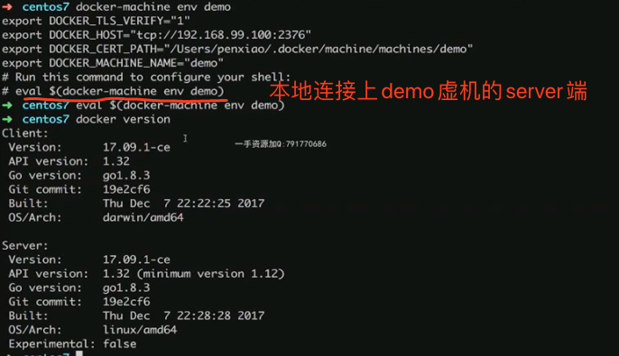
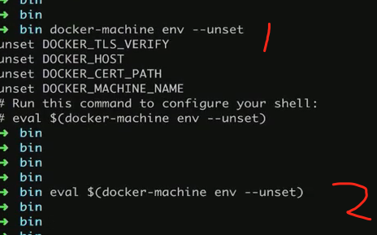

#### centos 安装docker
官方：https://docs.docker.com/install/linux/docker-ce/centos/

* 部分库拉取镜像的时候会timeout，可以选择更改仓库源地址到国内 *
https://blog.csdn.net/weixin_41929524/article/details/96770250

查看docker命令
`docker` 常用 `docker <Management Command> <Command> <Optional?ID>`


1、
```
sudo yum remove docker \
                  docker-client \
                  docker-client-latest \
                  docker-common \
                  docker-latest \
                  docker-latest-logrotate \
                  docker-logrotate \
                  docker-engine
```
2、
```
sudo yum install -y yum-utils \
  device-mapper-persistent-data \
  lvm2
```
3、
```
sudo yum-config-manager \
    --add-repo \
    https://download.docker.com/linux/centos/docker-ce.repo
```
4、
```
sudo yum install docker-ce docker-ce-cli containerd.io
```
5、
```
sudo systemctl start docker
```
6、
```
sudo docker run hello-world
```


### docker-machine
docker-machine create demo 快速新建一台装有docker的linux机器
docker-machine stop demo 关机demo
docker-machine ls 列出机器
docker-machine ssh demo 登录demo机器
docker-machine env demo 查看demo环境变量

切换server


恢复server

 
docker-machine 常用命令
最后说一下常用命令把，其实也没什么好讲的，都在help里面有，下面都是docker-machine后加的命令就是docker-machine command

active 查看活跃的 Docker 主机
config 输出连接的配置信息
create 创建一个 Docker 主机
env 显示连接到某个主机需要的环境变量
inspect 输出主机更多信息
ip 获取主机地址
kill 停止某个主机
ls 列出所有管理的主机
provision 重新设置一个已存在的主机
regenerate-certs 为某个主机重新生成 TLS 认证信息
restart 重启主机
rm 删除某台主机
ssh SSH 到主机上执行命令
scp 在主机之间复制文件
mount 挂载主机目录到本地
start 启动一个主机
status 查看主机状态
stop 停止一个主机
upgrade 更新主机 Docker 版本为最新
url 获取主机的 URL
version 输出 docker-machine 版本信息
help 输出帮助信息

###### 注意简写
`docker rm xxx` 默认是删除container，如果想要删除镜像执行 `docker rmi xxx`
`docker container commit` = `docker commit`
`docker image build` = `docker build`
`docker image push` = `docker push`


###### 组合用法
> `-q`相当于一个语法糖，例如 `docker rm $(docker container ls -aq)` = `docker container ls -a | awk ${'print$1'}`

1、删除全部containers
`docker rm $(docker container ls -aq)`
2、删除退出状态的containers
`docker rm $(docker container -f "status=exited" -q)`

### 普通用户下docker命令去掉sudo
1、创建用户组（已经存在）
`sudo groupadd docker`
2、把当前用户添加到`docker`组里面
`sudo gpasswd -a <username> docker`
3、重启docker进程
`sudo service docker restart`
4、重启机器并重新登录

### Dockerfile
#### RUN & CMD & ENTERPOINT
RUN: 执行命令并创建新的Image Layer
CMD: 设置容器启动后默认执行的命令和参数
ENTERPOINTER: 设置容器启动时运行的命令
###### CMD
容器启动时默认执行的命令
如果 `docker run` 指定了其他命令，CMD命令被忽略
如果定义了多个CMD，只有最后一个会执行
##### ENTERPOINT
让容器以应用程序或则服务的形式运行
不会被忽略，一定会执行
最佳实践：写一个shell脚本最为enterpoint


##### 容器之间的link
> 容器启动失败可以使用命令 `docker logs <container>`查看原因

在下面的命令中，test2能ping通172.17.3(test1的IP)，同时也能ping通test1(docker内部加了类似DNS的处理)，走的是默认网络bridge，反之test1仅能ping通172.17.2(test2的IP)，不能ping通test2。
`docker run -d --name test1 busybox /bin/sh -c "while true; do sleep 3600; done"` 
`docker run -d --name test2 --link test1 busybox /bin/sh -c "while true; do sleep 3600; done"` 
如果用自己创建的网络，可以实现双向互通。
> 推荐下载 `apt install bridge-utils`，方便查看系统内的bridge，`brctl show`

1、创建网络
`docker network create -d bridge my-bridge` -d 表示采用哪种driver（docker网络默认有三种driver，bridge、host、none）
现在如果用 `brctl show` 就会发现自己新创建出来的网络（会发现interfaces字段没有值）
2、创建一个container加入自建网络
`docker run -d --name test3 --nework my-bridge busybox /bin/sh -c "while true; do sleep 3600; done"`
现在如果用 `brctl show` 就会发现自己新创建出来的网络（会发现interfaces字段有值了）
也可以使用`docker network inspect my-bridge`查看链接进来的container
3、把已有container加入自建网络(这一步也可以是 创建一个container加入自建网络)
`docker network connect my-bridge test2`
`docker network inspect my-bridge`查看链接进来的container就会发现两个container
4、这样test2和test3就是互通的了，其中test2即链接到默认的`bridge`和自建的网络`my-bridge`

##### 容器端口映射
举例，创建一个`nginx`容器，想要把本地80端口映射到容器里面的80端口
`docker run --name web -d -p 80:80 nginx`


##### 多容器复杂应用的部署
先看一下程序，和 redis 组合使用
app.py
```
from flask import Flask
from redis import Redis
import os
import socket

app = Flask(__name__)
redis = Redis(host=os.environ.get('REDIS_HOST', '127.0.0.1'), port=6379)

@app.route('/')
def hello():
    redis.incr('hits')
    return 'Hello Container World! I have been seen %s times and my hostname is %s.\n' % (redis.get('hits'),socket.gethostname())

if __name__ == "__main__":
    app.run(host="0.0.0.0", port=5000, debug=True)
 docker run -d --link redis --name flask-redis -e REDIS_HOST=redis lengband/flask-redis
```
Dockerfile
> EXPOSE 5000 是为了本地启用时端口映射
```
FROM python:2.7
LABEL maintaner="lengband@163.com"
COPY . /app
WORKDIR /app
RUN pip install flask redis
EXPOSE 5000
CMD ["python", "app.py"]
```
1、启动 redis
`docker run -d --name redis redis`
2、打包镜像
`docker build -t lengband/flask-redis .`
3、启动镜像(指定环境变量`REDIS_HOST`)
`docker run -d --link redis --name flask-redis -e REDIS_HOST=redis lengband/flask-redis`
4、验证
先进入base，`docker exec -it flask-redis /bin/sh`，然后执行`curl 127.0.0.1:5000`,会输出如下
Hello Container World! I have been seen 1 times and my hostname is 3573f2231c28.
再次执行 `curl 127.0.0.1:5000`，会输出如下
Hello Container World! I have been seen 2 times and my hostname is 3573f2231c28.
此时，说明已经生效
5、（option）本地验证
先停止和删除原有container，
`docker stop lengband/flask-redis`和`docker rm lengband/flask-redis`
然后执行 `docker run -d -p 5000:5000 --link redis --name flask-redis -e REDIS_HOST=redis lengband/flask-redis`
之后打开浏览器 127.0.0.1:5000 既可以看见
Hello Container World! I have been seen 3 times and my hostname is 3573f2231c28.
如果没有浏览器，也可执行 `curl 127.0.0.1:5000`，进行验证


#### 部署一个workpress
1、` docker run -d --name mysql -v mysql-data:/var/lib/mysql -e MYSQL_ROOT_PASSWORD=root -e MYSQL_DATABASE=wordpress mysql`
2、` docker run -d -e WORDPRESS_DB_HOST=mysql:3306 --link mysql -p 8080:80 wordpress`
